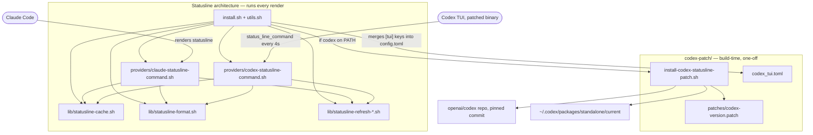

# agent-statusline

Shared Claude Code / Codex status line: thin provider adapters around the same
shell cache/format library and lazy caches. Claude keeps its three-line
layout. Codex displays those same three lines as a one-line carousel,
advancing every four seconds.

Personal, user-space tool - safe to run on any machine you don't own (no
root/sudo assumed anywhere, aside from Codex's own install).

## Usage

```bash
bash install.sh
```

Idempotent: safe to re-run any time. It deploys the shared library and
provider adapters, migrates in-place from a legacy
`~/opt/bootstrap-home/statusline` runtime the first time it's run, and - only
if `codex` is on `PATH` - builds/deploys the status-line-command patch and
wires `~/.codex/config.toml`.

## Architecture

Two independent mandates share this repo:

- **Statusline architecture** — `lib/` + `providers/`, deployed by `install.sh`
  and invoked on every render by Claude Code / Codex. This is the runtime
  path: shared cache, formatting, and per-provider adapters.
- **Codex patch** — `codex-patch/`, invoked once by `install.sh` (only when
  `codex` is on `PATH`) to give Codex's TUI a `status_line_command` extension
  point it doesn't ship with on the pinned version. Build-time only; nothing
  in it runs on a render.



`install.sh` is the only thing that crosses both mandates: it deploys the
statusline architecture unconditionally, then conditionally drives the Codex
patch. Nothing under `codex-patch/` is sourced by `lib/` or `providers/`, and
nothing under `lib/`/`providers/` is sourced by `codex-patch/` — the two
trees don't call into each other at runtime.

## Runtime layout

Deploys shared code and state under `~/opt/agent-statusline/`:

    lib/                          shared cache, formatting, and refresh scripts
    state/static/hostname         immutable short hostname
    state/static/host-color       immutable deterministic terminal color
    state/system/metrics          used GiB, total GiB, percent
    state/providers/claude        5h percent/reset, 7d percent/reset
    state/providers/claude.heartbeat  epoch of the last Claude render (see below)
    state/providers/codex         5h percent/reset, 7d percent/reset
    state/git/cwd/.../local       local Git snapshot for that cwd
    state/git/cwd/.../remote      remote Git snapshot for that cwd
    locks/                        atomic refresh locks
    logs/statusline.log           bounded shared refresh/write event log
    logs/statusline.log.1         previous log after 1 MiB rotation

Dynamic value files use ASCII file-separator delimiters and have a sibling
`.timestamp` containing their refresh epoch. Renderers read both with Bash
built-ins. Only the provider JSON payload requires `jq`.

## Lazy stale-while-revalidate flow

1. Read the existing value and timestamp.
2. If fresh, render it without starting a refresher.
3. If stale, try an atomic mkdir lock.
4. If another session owns the lock, immediately render the stale value.
5. The lock winner runs the relevant refresher synchronously with a hard timeout.
6. Success atomically replaces value and timestamp; failure keeps stale data.
7. A stale lock is atomically renamed to quarantine before removal.

There is no polling daemon or scheduler. Work happens only for data currently
being displayed, and sessions share machine-, provider-, and cwd-scoped
results.

The shared log records cache refresh/write events for both providers, including
failure exit codes, safe stderr, and stale-cache age. It deliberately does not
log every render: at 30 sessions and a four-second interval that would create
roughly 650,000 lines per day and add avoidable I/O. Epoch timestamps keep the
hot-path logger independent of another `date` subprocess.

| Cache | Scope | TTL | Refresh timeout |
|---|---|---:|---:|
| Hostname/color | machine | static | none |
| Memory | machine | 30s | 1s |
| Claude quotas | Claude account | 60s | 2s |
| Codex quotas | Codex account | 60s | payload update |
| Local Git | exact cwd | 8s | 1s |
| Remote Git | exact cwd | 30s | 1s |

Claude quotas are read from agent-quota-tracker's poll log
(`~/opt/agent-quota-tracker/data/utilization-log.jsonl`), not fetched from
Anthropic's OAuth usage endpoint directly — this repo used to poll that
endpoint itself on the same 60s cache TTL, and running that opportunistically
across every open session independently duplicated agent-quota-tracker's own
fixed-cadence poll of the same endpoint, causing 429s during busy
multi-session hours (see agent-quota-tracker's `AGENTS.md`). This repo's own
60s TTL is now just how often it re-reads that local log file — cheap, and
not itself a source of API traffic — while the actual quota freshness is
bounded by how often agent-quota-tracker polls: roughly every 60s while a
Claude Code statusline is rendering somewhere on the machine (this repo
touches `state/providers/claude.heartbeat` on every render specifically so
agent-quota-tracker can tell), backing off to roughly every 5 minutes once
idle. Soft dependency: if agent-quota-tracker isn't installed, the quota
segment just falls back to the payload's own numbers, same as any other
failed refresh.

Codex contributes its latest payload snapshot to the shared provider cache
because no separate stable local quota endpoint has been established -
`providers/codex-statusline-command.sh` makes no network call of its own.

## Codex status-line patch

Codex's TUI does not natively support a `status_line_command` the way this
project needs, on the supported pinned version. Everything for this lives in
`codex-patch/`, self-contained and separate from the statusline architecture
above. `install.sh` calls `codex-patch/install-codex-statusline-patch.sh`,
which:

- Clones `openai/codex` at the pinned commit for the installed Codex version
  (currently only 0.150.1 is supported; other versions are left unpatched).
- Applies `codex-patch/patches/codex-<version>-status-line-command.patch`.
- Builds a release binary with Cargo and deploys it as a
  `~/.codex/packages/standalone/releases/...` release, symlinked from
  `current`.
- Is idempotent: skips the clone/build entirely once the deployed binary's
  marker matches the pinned commit + patch hash.

Verbose clone/patch/compiler output is captured in
`~/opt/agent-statusline/codex-patch/build.log`, never streamed to the
terminal - only milestones and the final result print.

`install.sh` then owns just the `[tui]` status-line keys (`status_line`,
`status_line_use_colors`, `status_line_command`) in `~/.codex/config.toml`,
merging in `codex-patch/codex_tui.toml` via a `python3`/`tomllib` merge that
touches nothing else in that file.

## Source files

Statusline architecture (runs on every render):

- `lib/statusline-cache.sh`: paths, freshness, locking, timeouts, and atomic writes.
- `lib/statusline-format.sh`: shared colors, bars, limits, and Git formatting.
- `lib/statusline-refresh-*.sh`: one bounded refresh attempt, without cache policy.
- `lib/statusline-refresh-claude-quota.sh`: reads the latest Claude reading from agent-quota-tracker's poll log.
- `providers/claude-statusline-command.sh`: Claude adapter and multiline layout.
- `providers/codex-statusline-command.sh`: Codex adapter and one-line layout.
- `install.sh` + `utils.sh`: deployment, legacy-runtime migration, and Codex config wiring.

Codex patch (build-time, one-off; see "Codex status-line patch" above):

- `codex-patch/install-codex-statusline-patch.sh`: clone/patch/build/deploy the binary.
- `codex-patch/patches/`: one `.patch` per supported Codex version.
- `codex-patch/codex_tui.toml`: template merged into `~/.codex/config.toml`'s `[tui]` table.

## Tests

```bash
bash tests/run.sh
```

A hermetic bash test suite covering every file above - see `tests/README.md`
for what's covered and, deliberately, what isn't (the real Codex `git clone`
+ `cargo build` path, and live Anthropic/Keychain calls).

## Offline testing

Set `STATUSLINE_RUNTIME_DIR` to a temporary directory and `STATUSLINE_LIB_DIR`
to this repository's `lib/` directory, then pipe a captured provider payload
into the corresponding renderer. The first render may refresh stale data;
subsequent Codex renders should start only Bash and one payload `jq`. That
`jq` also supplies the refresh epoch used for cache freshness and carousel
selection. `tests/run.sh` automates exactly this pattern.
