# agent-statusline

Shared Claude Code / Codex status line: thin provider adapters around the same
shell cache/format library and lazy caches. Claude keeps its three-line
layout. Codex displays those same three lines as a one-line carousel,
advancing every four seconds. Also tracks both agents' usage-limit quotas
over time (`quota/`, folded in from the former `agent-quota-tracker` repo -
see "Quota tracking" below), since the statusline's own quota display and
the underlying research turned out to share the same account data.

Personal, user-space tool - safe to run on any machine you don't own (no
root/sudo assumed anywhere, aside from Codex's own install).

## Usage

```bash
bash install.sh
```

Idempotent: safe to re-run any time. It deploys the shared library and
provider adapters, migrates in-place from a legacy
`~/opt/bootstrap-home/statusline` runtime and (once) from a standalone
`agent-quota-tracker` install, deploys the quota pollers and their
LaunchAgent, and - only if `codex` is on `PATH` - builds/deploys the
status-line-command patch and wires `~/.codex/config.toml`. Requires
`python3` on `PATH`.

## Architecture

Three independent mandates share this repo:

- **Statusline architecture** — `lib/` + `providers/`, deployed by `install.sh`
  and invoked on every render by Claude Code / Codex. This is the runtime
  path: shared cache, formatting, and per-provider adapters.
- **Quota tracking** — `quota/`, folded in from the former
  `agent-quota-tracker` repo (full git history preserved under this prefix).
  A LaunchAgent-scheduled poller plus a free push from every Claude render,
  both writing to one shared log; separately, notebook-driven research into
  what the usage-limit percentages actually mean. See "Quota tracking" below.
- **Codex patch** — `codex-patch/`, invoked once by `install.sh` (only when
  `codex` is on `PATH`) to give Codex's TUI a `status_line_command` extension
  point it doesn't ship with on the pinned version. Build-time only; nothing
  in it runs on a render.

```mermaid
flowchart TB
    subgraph arch["Statusline architecture — runs every render"]
        direction TB
        installsh["install.sh + utils.sh"]
        libcache["lib/statusline-cache.sh"]
        libformat["lib/statusline-format.sh"]
        librefresh["lib/statusline-refresh-*.sh"]
        libpush["lib/statusline-push-claude-quota.sh"]
        provclaude["providers/claude-statusline-command.sh"]
        provcodex["providers/codex-statusline-command.sh"]
    end

    subgraph quota["quota/ — LaunchAgent poll + notebook research"]
        direction TB
        quotalaunchd["LaunchAgent, every 60s"]
        pollall["poll_all.py"]
        pollclaude["poll_claude.py"]
        pollcodex["poll_codex.py"]
        sharedlog[("data/utilization-log.jsonl")]
        notebook["analysis.ipynb"]
    end

    subgraph patch["codex-patch/ — build-time, one-off"]
        direction TB
        patchinstall["install-codex-statusline-patch.sh"]
        patchfiles["patches/codex-version.patch"]
        patchtoml["codex_tui.toml"]
    end

    upstream["openai/codex repo, pinned commit"]
    codexbin["~/.codex/packages/standalone/current"]
    claudecode(["Claude Code"])
    codextui(["Codex TUI, patched binary"])
    anthropicusage["GET /api/oauth/usage"]

    installsh --> libcache
    installsh --> libformat
    installsh --> librefresh
    installsh --> libpush
    installsh --> provclaude
    installsh --> provcodex
    installsh -->|"deploys + bootstraps"| quotalaunchd
    installsh -->|"if codex on PATH"| patchinstall
    installsh -->|"merges [tui] keys into config.toml"| patchtoml

    patchinstall --> patchfiles
    patchinstall --> upstream
    patchinstall --> codexbin

    provclaude --> libcache
    provclaude --> libformat
    provclaude --> librefresh
    provclaude -->|"pushes rate_limits, no network call"| libpush
    provcodex --> libcache
    provcodex --> libformat
    provcodex --> librefresh

    libpush --> sharedlog
    librefresh -->|"reads the latest reading"| sharedlog
    quotalaunchd --> pollall
    pollall --> pollclaude
    pollall --> pollcodex
    pollclaude -->|"~21% 429 rate - see quota/AGENTS.md"| anthropicusage
    pollclaude --> sharedlog
    pollcodex --> sharedlog
    sharedlog --> notebook

    claudecode -->|"renders statusline"| provclaude
    codextui -->|"status_line_command every 4s"| provcodex
```



`install.sh` is the only thing that reaches into all three mandates: it
deploys the statusline architecture and the quota poller/LaunchAgent
unconditionally, then conditionally drives the Codex patch. Nothing under
`codex-patch/` is sourced by `lib/` or `providers/`, and nothing under
`lib/`/`providers/` is sourced by `codex-patch/` — those two trees don't call
into each other at runtime. `quota/`'s coupling to `lib/`/`providers/` is
one-directional and file-based, not source-level: `lib/statusline-push-claude-quota.sh`
and `lib/statusline-refresh-claude-quota.sh` read/write the same
`data/utilization-log.jsonl` that `quota/poll_claude.py` and
`quota/poll_codex.py` do, but no script in either tree invokes a script in
the other.

## Runtime layout

Deploys shared code and state under `~/opt/agent-statusline/`:

    lib/                          shared cache, formatting, and refresh scripts
    quota/                        deployed poll_claude.py, poll_codex.py, poll_all.py, recompute_*.py
    data/utilization-log.jsonl    shared poll + push quota log (see "Quota tracking")
    data/token-events.jsonl       recomputed Claude token-usage detail (not scheduled, run by hand)
    data/codex-token-events.jsonl recomputed Codex token-usage detail (not scheduled, run by hand)
    state/static/hostname         immutable short hostname
    state/static/host-color       immutable deterministic terminal color
    state/system/metrics          used GiB, total GiB, percent
    state/providers/claude        5h percent/reset, 7d percent/reset
    state/providers/claude.heartbeat  epoch of the last Claude render (see below)
    state/providers/codex         5h percent/reset, 7d percent/reset
    state/git/cwd/.../local       local Git snapshot for that cwd
    state/git/cwd/.../remote      remote Git snapshot for that cwd
    locks/                        atomic refresh locks
    logs/statusline.log           bounded shared refresh/write event log
    logs/statusline.log.1         previous log after 1 MiB rotation
    logs/quota-poll.log           quota LaunchAgent stdout
    logs/quota-poll.err           quota LaunchAgent stderr
    com.jeanlescut.agent-statusline.plist  the quota LaunchAgent itself (symlinked from ~/Library/LaunchAgents/)

Dynamic value files use ASCII file-separator delimiters and have a sibling
`.timestamp` containing their refresh epoch. Renderers read both with Bash
built-ins. Only the provider JSON payload requires `jq`.

## Lazy stale-while-revalidate flow

1. Read the existing value and timestamp.
2. If fresh, render it without starting a refresher.
3. If stale, try an atomic mkdir lock.
4. If another session owns the lock, immediately render the stale value.
5. The lock winner runs the relevant refresher synchronously with a hard timeout.
6. Success atomically replaces value and timestamp; failure keeps stale data.
7. A stale lock is atomically renamed to quarantine before removal.

There is no polling daemon or scheduler. Work happens only for data currently
being displayed, and sessions share machine-, provider-, and cwd-scoped
results.

The shared log records cache refresh/write events for both providers, including
failure exit codes, safe stderr, and stale-cache age. It deliberately does not
log every render: at 30 sessions and a four-second interval that would create
roughly 650,000 lines per day and add avoidable I/O. Epoch timestamps keep the
hot-path logger independent of another `date` subprocess.

| Cache | Scope | TTL | Refresh timeout |
|---|---|---:|---:|
| Hostname/color | machine | static | none |
| Memory | machine | 30s | 1s |
| Claude quotas | Claude account | 60s | 2s |
| Codex quotas | Codex account | 60s | payload update |
| Local Git | exact cwd | 8s | 1s |
| Remote Git | exact cwd | 30s | 1s |

Claude quotas mostly skip this cache entirely: `providers/claude-statusline-command.sh`
prefers the live `rate_limits` values already present on every render's stdin
payload — no cache, no staleness, since it's exactly as fresh as Claude
Code's own in-memory quota state. The 60s-TTL cache above is a fallback for
the one case stdin can't cover (a session that hasn't sent its first message
yet), reading the latest reading from the shared quota log
(`~/opt/agent-statusline/data/utilization-log.jsonl`) instead of fetching
Anthropic's OAuth usage endpoint directly — see "Quota tracking" below for
why. Soft-fails closed if that log doesn't exist yet, same as any other
failed refresh.

Codex contributes its latest payload snapshot to the shared provider cache
because no separate stable local quota endpoint has been established -
`providers/codex-statusline-command.sh` makes no network call of its own.

## Quota tracking

`quota/` (folded in from the former `agent-quota-tracker` repo, full git
history preserved) empirically tracks both agents' usage-limit percentages
over time in one shared, append-only log:
`~/opt/agent-statusline/data/utilization-log.jsonl`. Three independent
writers, disambiguated by a `source` field, because the underlying data has
genuinely different persistence properties:

| `source` | Writer | Cadence | Why it exists |
|---|---|---|---|
| `claude` | `quota/poll_claude.py` (LaunchAgent, `GET /api/oauth/usage`) | ~60s while a statusline is live, ~5min idle | That endpoint has no history - a missed reading is permanently lost. Unreliable (~21% 429 rate historically; can lock out for 3+ days - see `quota/AGENTS.md`). |
| `codex` | `quota/poll_codex.py` (LaunchAgent, `codex app-server` JSON-RPC) | Skips while a Codex session is actively writing its own local snapshot, else ~5min | Codex has no plain HTTP usage endpoint. |
| `claude_statusline` | `lib/statusline-push-claude-quota.sh` (every Claude render) | Bounded by real message pace, not render interval | Free: Claude Code already carries live `rate_limits` on every `/v1/messages` response, riding on the statusline's own stdin payload - no network call, and far more reliable than the poll endpoint. |

Every `claude`/`codex` row also feeds `analysis.ipynb`'s research into what
these percentages actually mean (they track dollar-weighted API cost, not
raw token count - see `quota/AGENTS.md`'s "Findings" for the regression
behind that). `claude_statusline` rows carry a reduced shape - just the two
percentages, their resets, and `observed_at` (the transcript's own last
message timestamp, not append time) - since they're pushed far more often
than the poll rows and don't carry the full raw API response.

Concurrent writers append safely with no locking: every append is one
`write()` call under 4KB with the file opened `O_APPEND`, which POSIX
guarantees is atomic across processes. See `quota/AGENTS.md` for the full
investigation, findings, and gotchas - it's the single deepest document in
this repo and deliberately kept separate from this README.

## Codex status-line patch

Codex's TUI does not natively support a `status_line_command` the way this
project needs, on the supported pinned version. Everything for this lives in
`codex-patch/`, self-contained and separate from the statusline architecture
above. `install.sh` calls `codex-patch/install-codex-statusline-patch.sh`,
which:

- Clones `openai/codex` at the pinned commit for the installed Codex version
  (currently only 0.150.1 is supported; other versions are left unpatched).
- Applies `codex-patch/patches/codex-<version>-status-line-command.patch`.
- Builds a release binary with Cargo and deploys it as a
  `~/.codex/packages/standalone/releases/...` release, symlinked from
  `current`.
- Is idempotent: skips the clone/build entirely once the deployed binary's
  marker matches the pinned commit + patch hash.

Verbose clone/patch/compiler output is captured in
`~/opt/agent-statusline/codex-patch/build.log`, never streamed to the
terminal - only milestones and the final result print.

`install.sh` then owns just the `[tui]` status-line keys (`status_line`,
`status_line_use_colors`, `status_line_command`) in `~/.codex/config.toml`,
merging in `codex-patch/codex_tui.toml` via a `python3`/`tomllib` merge that
touches nothing else in that file.

## Source files

Statusline architecture (runs on every render):

- `lib/statusline-cache.sh`: paths, freshness, locking, timeouts, and atomic writes.
- `lib/statusline-format.sh`: shared colors, bars, limits, and Git formatting.
- `lib/statusline-refresh-*.sh`: one bounded refresh attempt, without cache policy.
- `lib/statusline-refresh-claude-quota.sh`: reads the latest `claude` poll reading from the shared quota log - fallback path only, see "Quota tracking".
- `lib/statusline-push-claude-quota.sh`: appends a `claude_statusline` row to the shared quota log from live stdin `rate_limits` - the primary path.
- `providers/claude-statusline-command.sh`: Claude adapter and multiline layout.
- `providers/codex-statusline-command.sh`: Codex adapter and one-line layout.
- `install.sh` + `utils.sh`: deployment, legacy-runtime migration, quota-poller/LaunchAgent deployment, and Codex config wiring.

Quota tracking (see "Quota tracking" above; own deep-dive docs in `quota/AGENTS.md`):

- `quota/poll_claude.py` / `quota/poll_codex.py` / `quota/poll_all.py`: the LaunchAgent-scheduled pollers.
- `quota/recompute_token_events.py` / `quota/recompute_codex_events.py`: not scheduled, run by hand to rebuild per-event token-usage detail from local transcripts.
- `quota/analysis.ipynb`: the research notebook - what the usage-limit percentages actually track.

Codex patch (build-time, one-off; see "Codex status-line patch" above):

- `codex-patch/install-codex-statusline-patch.sh`: clone/patch/build/deploy the binary.
- `codex-patch/patches/`: one `.patch` per supported Codex version.
- `codex-patch/codex_tui.toml`: template merged into `~/.codex/config.toml`'s `[tui]` table.

## Tests

```bash
bash tests/run.sh
```

A hermetic bash test suite covering every file above - see `tests/README.md`
for what's covered and, deliberately, what isn't (the real Codex `git clone`
+ `cargo build` path, and live Anthropic/Keychain calls).

## Offline testing

Set `STATUSLINE_RUNTIME_DIR` to a temporary directory and `STATUSLINE_LIB_DIR`
to this repository's `lib/` directory, then pipe a captured provider payload
into the corresponding renderer. The first render may refresh stale data;
subsequent Codex renders should start only Bash and one payload `jq`. That
`jq` also supplies the refresh epoch used for cache freshness and carousel
selection. `tests/run.sh` automates exactly this pattern.
