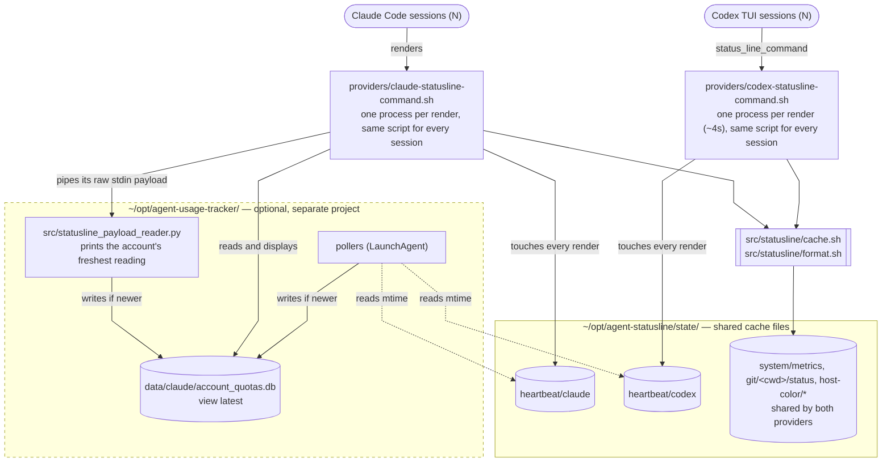

# agent-statusline

Shared Claude Code / Codex status line: thin provider adapters around the same shell cache/format library and lazy caches. Claude keeps its three-line layout. Codex displays those same three lines as a one-line carousel, advancing every four seconds.

Personal, user-space tool - safe to run on any machine you don't own (no root/sudo assumed anywhere, aside from Codex's own install).

Usage tracking (quota percent, tokens and spend over time, pollers, telemetry, research) is a separate project, [`agent-usage-tracker`](https://github.com/JeanLescutMuller/agent-usage-tracker), split out of this repo on 2026-09-30. The statusline is complete without it; with it, the Claude line also gets the tracker's poller readings. See "agent-usage-tracker" below for the whole contract.

## Usage

```bash
bash install.sh
```

Idempotent: safe to re-run any time against a machine that already has agent-statusline installed. It deploys the shared library and provider adapters (symlinked from `~/.claude/statusline-command.sh` and `~/.codex/statusline-command.sh`), and - only if `codex` is on `PATH` - builds/deploys the status-line-command patch and checks `~/.codex/config.toml`. Requires `jq` (and `python3` for the Codex config check).

`install.sh` assumes a bare machine and carries no legacy-layout migration logic. To move to an incompatible on-disk layout (or just start clean), run:

```bash
bash uninstall.sh   # removes what install.sh deploys; preserves codex-patch/; flags anything else left over
bash install.sh     # fresh install
```

## Architecture

Two independent mandates share this repo:

- **Statusline architecture** — `src/statusline/` + `providers/`, deployed by `install.sh` and invoked on every render by Claude Code / Codex. This is the runtime path: shared cache, formatting, and per-provider adapters.
- **Codex patch** — `codex-patch/`, invoked once by `install.sh` (only when `codex` is on `PATH`) to give Codex's TUI a `status_line_command` extension point it doesn't ship with on the pinned version. Build-time only; nothing in it runs on a render.

The diagram below is the **runtime view only** — what runs when a session renders its statusline. Dashed boxes belong to agent-usage-tracker and are optional.


```mermaid
%%{init: {"flowchart": {"curve": "linear"}}}%%
flowchart TB
    claudeS(["Claude Code sessions (N)"])
    codexS(["Codex TUI sessions (N)"])

    provclaude["providers/claude-statusline-command.sh
    one process per render, same script for every session"]
    provcodex["providers/codex-statusline-command.sh
    one process per render (~4s), same script for every session"]

    sharedlib[["src/statusline/cache.sh
    src/statusline/format.sh"]]

    subgraph state["~/opt/agent-statusline/state/ — shared cache files"]
        direction LR
        hbC[("heartbeat/claude")]
        hbX[("heartbeat/codex")]
        ccOther[("system/metrics, git/&lt;cwd&gt;/status, host-color/*
        shared by both providers")]
    end

    subgraph tracker["~/opt/agent-usage-tracker/ — optional, separate project"]
        direction LR
        ingest["src/statusline_payload_reader.py
        prints the account's freshest reading"]
        ccC[("data/claude/account_quotas.db
        view latest")]
        pollers["pollers (LaunchAgent)"]
    end

    claudeS -->|renders| provclaude
    codexS -->|"status_line_command"| provcodex

    provclaude --> sharedlib
    provcodex --> sharedlib
    sharedlib --> ccOther

    provclaude -->|touches every render| hbC
    provcodex -->|touches every render| hbX

    provclaude -->|"pipes its raw stdin payload"| ingest
    ingest -->|"writes if newer"| ccC
    provclaude -->|"reads and displays"| ccC
    pollers -.->|"reads mtime"| hbC
    pollers -.->|"reads mtime"| hbX
    pollers -->|"writes if newer"| ccC

    style tracker stroke-dasharray: 5 5
```

## agent-usage-tracker

The whole contract between the two projects is two files, each written by exactly one side. Only `providers/claude-statusline-command.sh` touches the tracker, and neither project ever writes into the other's tree.

| Interface | Written by | Read by | What |
|---|---|---|---|
| `~/opt/agent-usage-tracker/src/statusline_payload_reader.py` | tracker (deployed, executable) | Claude provider runs it | Every Claude render pipes its raw stdin payload into it, unchanged, before display; the statusline knows nothing about which fields the tracker keeps or where. It prints the account's freshest 5h/7d reading (any session, poller or machine; a passed reset already at 0%): one line of six `$'\034'`-separated fields, `five_pct five_reset week_pct week_reset source observed_at`, displayed as is; the last two fields are not read. Its stderr and a failed run are ignored; skipped if the file isn't executable; no line: the session's own reading. (Before 2026-10-10: `bin/ingest-claude-statusline.sh`, then the file `state/quota/claude`.) |
| `~/opt/agent-statusline/state/heartbeat/{claude,codex}` | statusline, every render | tracker's pollers | Only the mtime matters: "a statusline is on screen right now", so the pollers poll faster. |

`AGENT_USAGE_TRACKER_DIR` overrides the tracker's location (the tests point it at a stub).

**Why the Claude line shows the tracker's file, not its own stdin.** `rate_limits` on stdin is only *that session's* last-known reading, updated solely when that session gets a fresh API response, while the 5h/7d quota is account-wide: sessions showing their own stdin disagree. The tracker keeps the one "latest reading" file for the account, fed by every session's payload and by its poller, and dates each reading by when it became true, so every open session shows the same, freshest number. This repo keeps no copy of it. Within `rate_limits`, a missing window means none is open: 0%, as the API reports it.

| Installed | Claude quota display |
|---|---|
| Both | The tracker's file: freshest of every session's stdin and its polls |
| Statusline only | Each session's own stdin reading; `–` before its first message |
| Tracker only | No statusline at all, so the tracker gets no payloads and records no push rows |

Codex never depends on the tracker: each Codex session shows its own payload's rate limits.

## Runtime layout

Deploys shared code and state under `~/opt/agent-statusline/`:

    ~/opt/agent-statusline/
    ├── src/statusline/
    │   ├── cache.sh                      shared lazy-cache primitives (stale-while-revalidate, locking)
    │   ├── format.sh                     shared ANSI styling and segment formatting
    │   ├── refresh-git.sh                branch/untracked/unstaged/staged/conflicts/ahead/behind (no fetch)
    │   └── refresh-metrics.sh            used/total/percent memory
    ├── providers/                        deployed adapters; ~/.claude and ~/.codex hold symlinks to these
    ├── state/
    │   ├── host-color/<hostname>         terminal color the hostname is printed in (the name itself is read live)
    │   ├── system/metrics                used GiB, total GiB, percent
    │   ├── heartbeat/
    │   │   ├── claude                    epoch of the last Claude render (read by agent-usage-tracker)
    │   │   └── codex                     epoch of the last Codex render (read by agent-usage-tracker)
    │   ├── spin/                         per-provider spinner counters
    │   └── git/cwd/.../status            Git snapshot for that cwd
    ├── locks/                            refresh locks (noclobber files holding their epoch)
    └── codex-patch/                      Codex clone + build.log (kept by uninstall.sh)

Dynamic value files use ASCII file-separator delimiters and have a sibling `.timestamp` containing their refresh epoch. Renderers read both with Bash built-ins. Only the provider JSON payload requires `jq`.

## Lazy stale-while-revalidate flow

1. Read the existing value and timestamp.
2. If fresh, render it without starting a refresher.
3. If stale, try to create the lock file atomically (noclobber).
4. If another session owns the lock, immediately render the stale value.
5. The lock winner stamps the timestamp, then runs the refresher synchronously with a hard timeout.
6. Success atomically replaces the value; failure (or empty output) keeps the previous one until the next TTL - no retry on every render.
7. A lock older than its stale limit (a killed renderer) is taken over.

There is no polling daemon or scheduler. Work happens only for data currently being displayed, and sessions share machine-, provider-, and cwd-scoped results.

Nothing is logged: a failed refresh shows as a stale or missing segment. Rerun the refresher by hand (`bash ~/opt/agent-statusline/src/statusline/refresh-git.sh <dir>`) to see why.

| Cache | Scope | TTL | Refresh timeout |
|---|---|---:|---:|
| Host color | hostname | forever | none |
| Memory | machine | 30s | 1s |
| Git | exact cwd | 8s | 1s |

Claude quotas aren't in this table: agent-usage-tracker's reader prints them on every render (see "agent-usage-tracker").

## Codex status-line patch

Codex's TUI does not natively support a `status_line_command` the way this project needs, on the supported pinned version. Everything for this lives in `codex-patch/`, self-contained and separate from the statusline architecture above. `install.sh` calls `codex-patch/install-codex-statusline-patch.sh`, which:

- Clones `openai/codex` at the exact release commit allowlisted in `codex-patch/supported-versions.tsv` (currently 0.150.1 through 0.154.0; unknown versions are left unpatched).
- Checks and applies the shared `codex-patch/patches/codex-status-line-command.patch`; almost all custom Rust lives in one isolated module to keep upstream integration points small.
- Builds a release binary with Cargo, pairs it with the matching official `codex-code-mode-host`, and deploys both as a `~/.codex/packages/standalone/releases/...` release, symlinked from `current`.
- Is idempotent: skips the clone/build entirely once the deployed binary's marker matches the pinned commit + patch hash.

Verbose clone/patch/compiler output is captured in `~/opt/agent-statusline/codex-patch/build.log`, never streamed to the terminal - only milestones and the final result print.

`install.sh` then checks, without editing, that `~/.codex/config.toml`'s `[tui]` has `status_line = ["custom"]` and `status_line_use_colors = true`, and prints those two lines when it doesn't. The patched binary reads `CODEX_STATUS_LINE_COMMAND` or falls back to `~/.codex/statusline-command.sh`.

## Source files

Statusline architecture (runs on every render):

- `src/statusline/cache.sh`: paths, freshness, locking, timeouts, atomic writes, and the heartbeat.
- `src/statusline/format.sh`: shared colors, bars, limits, and Git formatting.
- `src/statusline/refresh-*.sh`: one bounded refresh attempt, without cache policy.
- `providers/claude-statusline-command.sh`: Claude adapter and multiline layout; the only file that touches agent-usage-tracker.
- `providers/codex-statusline-command.sh`: Codex adapter and one-line layout.
- `install.sh` + `utils.sh`: deployment and the Codex config check - assumes a bare machine, no migration logic.
- `uninstall.sh`: removes everything `install.sh` deploys; preserves `codex-patch/`; flags anything else left over as an orphan.

Codex patch (build-time, one-off; see "Codex status-line patch" above):

- `codex-patch/install-codex-statusline-patch.sh`: clone/patch/build/deploy the binary.
- `codex-patch/supported-versions.tsv`: exact supported version/commit pairs.
- `codex-patch/patches/`: the shared cross-version patch.

## Tests

```bash
bash tests/run.sh
```

A hermetic bash test suite covering every file above - see `tests/README.md` for what's covered and, deliberately, what isn't (the real Codex `git clone` + `cargo build` path, and agent-usage-tracker itself, which is replaced by a stub).

## Offline testing

Set `STATUSLINE_RUNTIME_DIR` to a temporary directory, `STATUSLINE_LIB_DIR` to this repository's `src/statusline/` directory, and `AGENT_USAGE_TRACKER_DIR` to an empty directory, then pipe a captured provider payload into the corresponding renderer. The first render may refresh stale data; subsequent Codex renders should start only Bash and one payload `jq`. That `jq` also supplies the refresh epoch used for cache freshness and carousel selection. `tests/run.sh` automates exactly this pattern.
