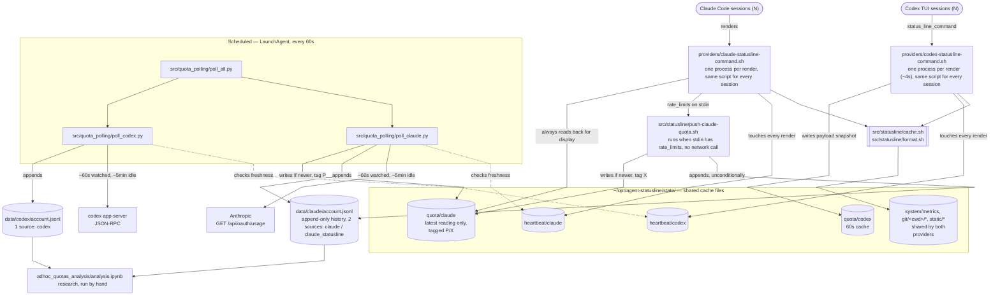

# agent-statusline

Shared Claude Code / Codex status line: thin provider adapters around the same
shell cache/format library and lazy caches. Claude keeps its three-line
layout. Codex displays those same three lines as a one-line carousel,
advancing every four seconds. Also tracks both agents' quota percentages
over time (`src/quota_polling/` + `adhoc_quotas_analysis/`, folded in from
the former `agent-quota-tracker` repo - see "Quota tracking" below), since
the statusline's own quota display and the underlying research turned out
to share the same account data.

Personal, user-space tool - safe to run on any machine you don't own (no
root/sudo assumed anywhere, aside from Codex's own install).

## Usage data documentation

Two canonical files, which other projects that read or convert this data (`agent-quota-maximizer`) link to instead of restating them:

- `USAGE_DATA_SOURCES.md` — **what usage data exists upstream**, independent of this repository: every Claude and Codex source (transcripts, status-line stdin, APIs, OpenTelemetry, the ChatGPT backend), each unit (quota percent / tokens / USD) at each granularity, tested live, plus what is not available anywhere.
- `USAGE_DATA_REFERENCE.md` — **what this repository captures**: which writer records what, when, from which source, into which file, with which shape, and the traps consumers must handle (stale readings and the envelope rule, the `observed_at` DST offset, Codex's fake idle countdown, the poller's failure rate).

The dollar conversions both assume are derived in `adhoc_quotas_analysis/CONCLUSIONS.md`.

`install.sh` also turns on Claude Code's OpenTelemetry export by adding a few keys to the `env` object of `~/.claude/settings.json` (only those keys; `uninstall.sh` removes them), and runs a local receiver on `127.0.0.1:4318` that writes per-request usage events into each session's own `data/claude/<session-id>.jsonl` — see `USAGE_DATA_REFERENCE.md` §9.

All usage data is split by agent and by **scope**: `data/<agent>/account.jsonl` holds the account-wide meter (quota percent), `data/<agent>/<session-id>.jsonl` holds one session's tokens and spend. **Quota percent is account-scope only**, never in a session file — see `USAGE_DATA_REFERENCE.md` §1.

## Usage

```bash
bash install.sh
```

Idempotent: safe to re-run any time against a machine that already has
agent-statusline installed. It deploys the shared library and provider
adapters, deploys the quota pollers and their LaunchAgent, and - only if
`codex` is on `PATH` - builds/deploys the status-line-command patch and
wires `~/.codex/config.toml`. Requires `python3` on `PATH`.

`install.sh` assumes a bare machine and carries no legacy-layout migration
logic. To move to an incompatible on-disk layout (or just start clean), run:

```bash
bash uninstall.sh   # removes what install.sh deploys; preserves data/ and
                     # codex-patch/; flags anything else left over
bash install.sh      # fresh install
```

## Architecture

Four independent mandates share this repo:

- **Statusline architecture** — `src/statusline/` + `providers/`, deployed by `install.sh`
  and invoked on every render by Claude Code / Codex. This is the runtime
  path: shared cache, formatting, and per-provider adapters.
- **Quota polling** — `src/quota_polling/`, the LaunchAgent-scheduled
  pollers (`poll_claude.py`, `poll_codex.py`, `poll_all.py`), split out of
  `adhoc_quotas_analysis/` on 2026-08-31 as genuinely production code
  (scheduled, deployed, run unattended) distinct from the ad hoc research
  material below. Writes the per-provider quota logs a free push from every
  Claude render also writes to. See "Quota tracking" below.
- **Quota research** — `adhoc_quotas_analysis/`, folded in from the former
  `agent-quota-tracker` repo (full git history preserved under this prefix).
  Not-scheduled, run-by-hand tooling (`recompute_*.py`, a one-time log-split
  migration) plus notebook-driven research into what the quota percentages
  actually mean. See "Quota tracking" below.
- **Codex patch** — `codex-patch/`, invoked once by `install.sh` (only when
  `codex` is on `PATH`) to give Codex's TUI a `status_line_command` extension
  point it doesn't ship with on the pinned version. Build-time only; nothing
  in it runs on a render.

The diagram below is the **runtime view only** — what actually runs when a
session renders its statusline, and what the quota LaunchAgent does on its
own schedule. `install.sh`/`utils.sh` (deploy-time) and `codex-patch/`
(build-time, one-off, never invoked on a render) are covered in their own
sections instead of diagrammed here.


```mermaid
%%{init: {"flowchart": {"curve": "linear"}}}%%
flowchart TB
    claudeS(["Claude Code sessions (N)"])
    codexS(["Codex TUI sessions (N)"])

    provclaude["providers/claude-statusline-command.sh
    one process per render, same script for every session"]
    provcodex["providers/codex-statusline-command.sh
    one process per render (~4s), same script for every session"]

    sharedlib[["src/statusline/cache.sh
    src/statusline/format.sh"]]

    subgraph state["~/opt/agent-statusline/state/ — shared cache files"]
        direction LR
        hbC[("heartbeat/claude")]
        hbX[("heartbeat/codex")]
        ccC[("quota/claude
        latest reading only, tagged P/X")]
        ccX[("quota/codex
        60s cache")]
        ccOther[("system/metrics, git/&lt;cwd&gt;/*, static/*
        shared by both providers")]
    end

    pushscript["src/statusline/push-claude-quota.sh
    runs when stdin has rate_limits, no network call"]

    claudelog[("data/claude/account.jsonl
    append-only history, 2 sources: claude / claude_statusline")]
    codexlog[("data/codex/account.jsonl
    1 source: codex")]

    subgraph pollers["Scheduled — LaunchAgent, every 60s"]
        direction TB
        pollall["src/quota_polling/poll_all.py"]
        pollclaude["src/quota_polling/poll_claude.py"]
        pollcodex["src/quota_polling/poll_codex.py"]
    end

    anthropicusage["Anthropic
    GET /api/oauth/usage"]
    codexrpc["codex app-server
    JSON-RPC"]
    notebook["adhoc_quotas_analysis/analysis.ipynb
    research, run by hand"]

    claudeS -->|renders| provclaude
    codexS -->|"status_line_command"| provcodex

    provclaude --> sharedlib
    provcodex --> sharedlib
    sharedlib --> ccOther

    provclaude -->|touches every render| hbC
    provcodex -->|touches every render| hbX

    provclaude -->|"rate_limits on stdin"| pushscript
    pushscript -->|"appends, unconditionally"| claudelog
    pushscript -->|"writes if newer, tag X"| ccC
    provclaude -->|"always reads back for display"| ccC

    provcodex -->|writes payload snapshot| ccX

    pollall --> pollclaude
    pollall --> pollcodex
    pollclaude -.->|checks freshness| hbC
    pollclaude -->|"~60s watched, ~5min idle"| anthropicusage
    pollclaude -->|appends| claudelog
    pollclaude -->|"writes if newer, tag P"| ccC
    pollcodex -.->|checks freshness| hbX
    pollcodex -->|"~60s watched, ~5min idle"| codexrpc
    pollcodex -->|appends| codexlog

    claudelog --> notebook
    codexlog --> notebook
```

Two independent write paths feed `claude/account.jsonl`, disambiguated
by `source`: the free per-render push (`claude_statusline`, rides existing
traffic) and the fixed-cadence poll (`claude`, this account's only caller of
that endpoint). `codex/account.jsonl` has a single writer,
`poll_codex.py` — Codex has no equivalent free per-render push (see "Quota
tracking" below for why). The coupling between the render path and the poll
path is entirely file-based — a heartbeat file, a per-provider history log,
and a per-provider "latest reading" state file — never a direct script call
in either direction; see "Quota tracking" below for why each writer exists.

The two Claude writers feed `state/quota/claude` directly, not just the
history log: both compare the reading's own `observed_at` (when it was
actually true, not write/render time) against whatever's already in the
state file and only overwrite if newer, so whichever producer has the
genuinely freshest reading wins regardless of write order - a concurrent
session's live push can refresh a brand-new idle session's fallback display
just as well as the poller can. See `AGENTS.md`'s "Quota tracking" section
for the full mechanism and why an earlier design (rescanning the history log
at read time) didn't hold up.

## Runtime layout

Deploys shared code and state under `~/opt/agent-statusline/`. `adhoc_quotas_analysis/`
is deliberately not part of this tree - it's ad-hoc, run-by-hand research
tooling, not scheduled or deployed anywhere, so per this machine's own
`~/dev` vs `~/opt` convention it stays in the `~/dev/agent-statusline`
checkout and runs from there (see that directory's own `README.md`/`AGENTS.md`),
even though it reads/writes this same runtime's `data/`:

    ~/opt/agent-statusline/
    ├── src/
    │   ├── statusline/
    │   │   ├── cache.sh           shared lazy-cache primitives (stale-while-revalidate, locking)
    │   │   ├── format.sh          shared ANSI styling and segment formatting
    │   │   ├── push-claude-quota.sh     appends to the claude quota log, writes state/quota/claude directly (tag X)
    │   │   ├── refresh-git-local.sh     branch/untracked/unstaged/staged/conflicts
    │   │   ├── refresh-git-remote.sh    ahead/behind
    │   │   └── refresh-metrics.sh       used/total/percent memory
    │   ├── quota_polling/                deployed poll_claude.py, poll_codex.py, poll_codex_plan_history.py, poll_all.py
    │   └── telemetry/                    deployed otlp_receiver.py
    ├── providers/                        deployed adapters; ~/.claude and ~/.codex hold symlinks to these
    ├── data/                             see USAGE_DATA_REFERENCE.md
    │   ├── claude/
    │   │   ├── account.jsonl             account scope: Claude poll + push meter readings (quota percent)
    │   │   └── <session-id>.jsonl        session scope: push session rows + telemetry rows (never a percent)
    │   ├── codex/
    │   │   └── account.jsonl             account scope: Codex poll + plan-history rows
    │   ├── _unattributed/                telemetry events with no usable session id
    │   └── _archive/                     pre-2026-09-30 logs, kept after the one-time split_by_scope.py migration
    ├── state/
    │   ├── static/
    │   │   ├── hostname                  immutable short hostname
    │   │   └── host-color                terminal color the hostname is printed in
    │   ├── system/
    │   │   └── metrics                   used GiB, total GiB, percent
    │   ├── heartbeat/
    │   │   ├── claude                    epoch of the last Claude render (see below)
    │   │   └── codex                     epoch of the last Codex render (see below)
    │   ├── quota/
    │   │   ├── claude                    latest reading only: 5h/7d percent+reset, source tag (P/X), observed_at
    │   │   └── codex                     5h percent/reset, 7d percent/reset
    │   └── git/cwd/.../
    │       ├── local                     local Git snapshot for that cwd
    │       └── remote                    remote Git snapshot for that cwd
    ├── locks/                            atomic refresh locks
    ├── logs/
    │   ├── statusline.log                bounded shared refresh/write event log
    │   ├── statusline.log.1              previous log after 1 MiB rotation
    │   ├── quota-poll.log                quota LaunchAgent stdout
    │   └── quota-poll.err                quota LaunchAgent stderr
    └── com.jeanlescut.agent-statusline.plist   quota LaunchAgent (symlinked from ~/Library/LaunchAgents/)

Dynamic value files use ASCII file-separator delimiters and have a sibling
`.timestamp` containing their refresh epoch. Renderers read both with Bash
built-ins. Only the provider JSON payload requires `jq`.

## Lazy stale-while-revalidate flow

1. Read the existing value and timestamp.
2. If fresh, render it without starting a refresher.
3. If stale, try an atomic mkdir lock.
4. If another session owns the lock, immediately render the stale value.
5. The lock winner runs the relevant refresher synchronously with a hard timeout.
6. Success atomically replaces value and timestamp; failure keeps stale data.
7. A stale lock is atomically renamed to quarantine before removal.

There is no polling daemon or scheduler. Work happens only for data currently
being displayed, and sessions share machine-, provider-, and cwd-scoped
results.

The shared log records cache refresh/write events for both providers, including
failure exit codes, safe stderr, and stale-cache age. It deliberately does not
log every render: at 30 sessions and a four-second interval that would create
roughly 650,000 lines per day and add avoidable I/O. Epoch timestamps keep the
hot-path logger independent of another `date` subprocess.

| Cache | Scope | TTL | Refresh timeout |
|---|---|---:|---:|
| Hostname/color | machine | static | none |
| Memory | machine | 30s | 1s |
| Codex quotas | Codex account | 60s | payload update |
| Local Git | exact cwd | 8s | 1s |
| Remote Git | exact cwd | 30s | 1s |

Claude quotas aren't in this table because they don't go through the lazy
stale-while-revalidate machinery above at all - they're a different, simpler
mechanism. `providers/claude-statusline-command.sh` always displays
`state/quota/claude`, a single small file holding only the latest known
reading - kept fresh by direct writes, not a scheduled refresh: whenever
stdin has live `rate_limits`, this render pushes them into that file first
(`src/statusline/push-claude-quota.sh`), and `src/quota_polling/poll_claude.py`
does the same on its own schedule; both compare the reading's own
`observed_at` against what's already there and write only if newer. Every
render then just reads the file back, so it always shows the single
freshest reading known anywhere on the machine - this session's own, or a
concurrent session's, or the poller's - rather than each session being
stuck showing its own possibly-stale last-known value. See "Quota tracking"
below for the full mechanism.

Codex contributes its latest payload snapshot to the shared provider cache
because no separate stable local quota endpoint has been established -
`providers/codex-statusline-command.sh` makes no network call of its own.

## Quota tracking

`src/quota_polling/` + `adhoc_quotas_analysis/` (folded in from the former
`agent-quota-tracker` repo, full git history preserved under the latter)
empirically track both agents' quota percentages over time in two
append-only, per-agent account-scope logs (per-provider until 2026-09-30):
`~/opt/agent-statusline/data/claude/account.jsonl` and
`data/codex/account.jsonl` (split from a single combined
`data/quota-log.jsonl` on 2026-08-31 - see `adhoc_quotas_analysis/AGENTS.md`'s
"Naming history"). Three independent writers across the two files,
disambiguated within `claude/account.jsonl` by a `source` field,
because the underlying data has genuinely different persistence properties:

| File | `source` | Writer | Cadence | Why it exists |
|---|---|---|---|---|
| `claude/account.jsonl` | `claude` | `src/quota_polling/poll_claude.py` (LaunchAgent, `GET /api/oauth/usage`) | ~60s while a statusline is live, ~5min idle | That endpoint has no history - a missed reading is permanently lost. Unreliable (~21% 429 rate historically; can lock out for 3+ days - see `adhoc_quotas_analysis/AGENTS.md`). |
| `claude/account.jsonl` | `claude_statusline` | `src/statusline/push-claude-quota.sh` (every Claude render) | Bounded by real message pace, not render interval | Free: Claude Code already carries live `rate_limits` on every `/v1/messages` response, riding on the statusline's own stdin payload - no network call, and far more reliable than the poll endpoint. |
| `codex/account.jsonl` | `codex` | `src/quota_polling/poll_codex.py` (LaunchAgent, `codex app-server` JSON-RPC) | Skips while a Codex session is actively writing its own local snapshot; else ~60s while a Codex statusline is rendering (`heartbeat/codex`, same mechanism as Claude's), backing off to ~5min once nothing is open | Codex has no plain HTTP usage endpoint, and unlike Claude's rate_limits, its local session file already durably records this - so instead of a statusline push, it just needed the same "someone is watching" speedup Claude's poller has. |

Every `claude`/`codex` row also feeds `analysis.ipynb`'s research into what
these percentages actually mean (they track dollar-weighted API cost, not
raw token count - see `adhoc_quotas_analysis/AGENTS.md`'s "Findings" for the regression
behind that). `claude_statusline` rows carry a reduced shape - just the two
percentages, their resets, and `observed_at` (the transcript's own last
message timestamp, not append time) - since they're pushed far more often
than the poll rows and don't carry the full raw API response.

Concurrent writers append safely with no locking: every append is one
`write()` call under 4KB with the file opened `O_APPEND`, which POSIX
guarantees is atomic across processes. These two files are pure history now
- nothing reads them at render time - so there's also no dedup or ordering
guarantee between the two Claude writers: each just appends unconditionally
whenever it has a genuine reading, `source` disambiguates them, and
`adhoc_quotas_analysis/analysis.ipynb` is free to reconcile ordering itself
at analysis time if it ever needs to.

### The "latest known quota" state file

`providers/claude-statusline-command.sh` always displays whatever's in
`state/quota/claude` (see "Lazy stale-while-revalidate flow" above) for
every render, live rate_limits on stdin or not - there is no separate
"show my own live value directly" path. That's deliberate: rate_limits on
stdin is only *that session's* last-known reading, updated solely when that
session gets a fresh API response, while the 5h/7d quota is account-wide
and shared across every open session. Three sessions that last talked to
the API at three different moments used to each show their own frozen
snapshot - all individually accurate as of their own last message, but
disagreeing with each other and with the true current usage. Reading back
one shared file instead means every session converges on whichever reading
is genuinely freshest within about one render cycle, regardless of which
session or poller produced it.

That file is also deliberately not derived from the two history logs by
rescanning at read time (an earlier design did exactly that, and broke
under real load: the poll reading only lands a few times a day at most, and
got crowded out of even a generous tail window by the far more frequent
pushes). Instead, both Claude writers push straight to this one small file,
whichever has the fresher reading wins:

| Writer | Tag | Compares |
|---|---|---|
| `src/statusline/push-claude-quota.sh` (every render with live rate_limits) | `X` | this push's `observed_at` - the transcript's last message timestamp when available, else "now" as a best-effort fallback (still a live reading, just without a precise "as of" moment) |
| `src/quota_polling/poll_claude.py` | `P` | the poll's own `ts` (a live API call, so poll time ≈ observation time) |

Both writers call the same compare-then-atomically-overwrite primitive -
`statusline_write_quota_if_newer` in `src/statusline/cache.sh` (bash side)
and `write_state_if_newer` in `src/quota_polling/_quota_common.py` (Python
side, same six-field format) - no locking, since a same-instant write race
only risks a slightly-less-fresh value for one render until the next write
(from either side) self-corrects. The file starts out simply absent;
whichever writer runs first creates it, no separate seed/placeholder step
needed. The statusline displays whichever tag ends up in the file next to
the percentage (`65% (P)`), so which mechanism actually produced a given
reading is visible at a glance while reading the live statusline, not just
from the source.

## Codex status-line patch

Codex's TUI does not natively support a `status_line_command` the way this
project needs, on the supported pinned version. Everything for this lives in
`codex-patch/`, self-contained and separate from the statusline architecture
above. `install.sh` calls `codex-patch/install-codex-statusline-patch.sh`,
which:

- Clones `openai/codex` at the exact release commit allowlisted in
  `codex-patch/supported-versions.tsv` (currently 0.150.1 through 0.154.0;
  unknown versions are left unpatched).
- Checks and applies the shared
  `codex-patch/patches/codex-status-line-command.patch`; almost all custom Rust
  lives in one isolated module to keep upstream integration points small.
- Builds a release binary with Cargo, pairs it with the matching official
  `codex-code-mode-host`, and deploys both as a
  `~/.codex/packages/standalone/releases/...` release, symlinked from `current`.
- Is idempotent: skips the clone/build entirely once the deployed binary's
  marker matches the pinned commit + patch hash.

Verbose clone/patch/compiler output is captured in
`~/opt/agent-statusline/codex-patch/build.log`, never streamed to the
terminal - only milestones and the final result print.

`install.sh` then runs `codex-patch/merge_codex_config.py`, which owns just the
`[tui]` keys `status_line` and `status_line_use_colors` in
`~/.codex/config.toml`, merging in `codex-patch/codex_tui.toml` via `tomllib`
and touching nothing else in that file. It also removes the obsolete
`[tui.status_line_command]` table written by older installers; the patched
binary reads `CODEX_STATUS_LINE_COMMAND` or falls back to
`~/.codex/statusline-command.sh`.

## Source files

Statusline architecture (runs on every render):

- `src/statusline/cache.sh`: paths, freshness, locking, timeouts, and atomic writes.
- `src/statusline/format.sh`: shared colors, bars, limits, and Git formatting.
- `src/statusline/refresh-*.sh`: one bounded refresh attempt, without cache policy.
- `src/statusline/push-claude-quota.sh`: appends a `claude_statusline` row to the Claude quota log, and writes `state/quota/claude` directly (tag `X`) from live stdin `rate_limits` - the primary path, see "The 'latest known quota' state file".
- `providers/claude-statusline-command.sh`: Claude adapter and multiline layout.
- `providers/codex-statusline-command.sh`: Codex adapter and one-line layout.
- `install.sh` + `utils.sh`: deployment, quota-poller/LaunchAgent deployment, and Codex config wiring - assumes a bare machine, no migration logic.
- `uninstall.sh`: removes everything `install.sh` deploys; preserves `data/` and `codex-patch/`; flags anything else left over as an orphan.

Quota polling (see "Quota tracking" above; deployed, LaunchAgent-scheduled, unattended):

- `src/quota_polling/poll_claude.py` / `src/quota_polling/poll_codex.py` / `src/quota_polling/poll_all.py`: the LaunchAgent-scheduled pollers.
- `src/quota_polling/com.jeanlescut.agent-statusline.plist.template`: `__PYTHON3__`/`__RUNTIME__` placeholders, filled in by `install.sh` (`sed`) at install time and written to `~/opt/agent-statusline/`, symlinked from `~/Library/LaunchAgents/`.

Quota research (see "Quota tracking" above; own deep-dive docs in `adhoc_quotas_analysis/AGENTS.md`; not scheduled, run by hand):

- `adhoc_quotas_analysis/split_quota_log.py`: one-time, idempotent migration from the old combined `data/quota-log.jsonl` to the two per-provider files - run by hand only if you still have that old file.
- `adhoc_quotas_analysis/recompute_codex_events.py`: rebuilds `adhoc_quotas_analysis/codex-token-events.jsonl` from local transcripts (not yet loaded into the notebook - see its own "Codex" section).
- `adhoc_quotas_analysis/analysis.ipynb`: the research notebook - what the quota percentages actually track. Recomputes `claude-token-events.jsonl` itself, inline, in its own first cells - no separate script for the Claude side.

Codex patch (build-time, one-off; see "Codex status-line patch" above):

- `codex-patch/install-codex-statusline-patch.sh`: clone/patch/build/deploy the binary.
- `codex-patch/supported-versions.tsv`: exact supported version/commit pairs.
- `codex-patch/patches/`: the shared cross-version patch.
- `codex-patch/codex_tui.toml`: template merged into `~/.codex/config.toml`'s `[tui]` table.
- `codex-patch/merge_codex_config.py`: the merge logic, run by `install.sh`'s "codex config" step.

## Tests

```bash
bash tests/run.sh
```

A hermetic bash test suite covering every file above - see `tests/README.md`
for what's covered and, deliberately, what isn't (the real Codex `git clone`
+ `cargo build` path, and live Anthropic/Keychain calls).

## Offline testing

Set `STATUSLINE_RUNTIME_DIR` to a temporary directory and `STATUSLINE_LIB_DIR`
to this repository's `src/statusline/` directory, then pipe a captured provider payload
into the corresponding renderer. The first render may refresh stale data;
subsequent Codex renders should start only Bash and one payload `jq`. That
`jq` also supplies the refresh epoch used for cache freshness and carousel
selection. `tests/run.sh` automates exactly this pattern.
